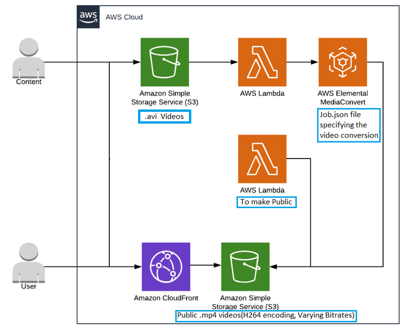
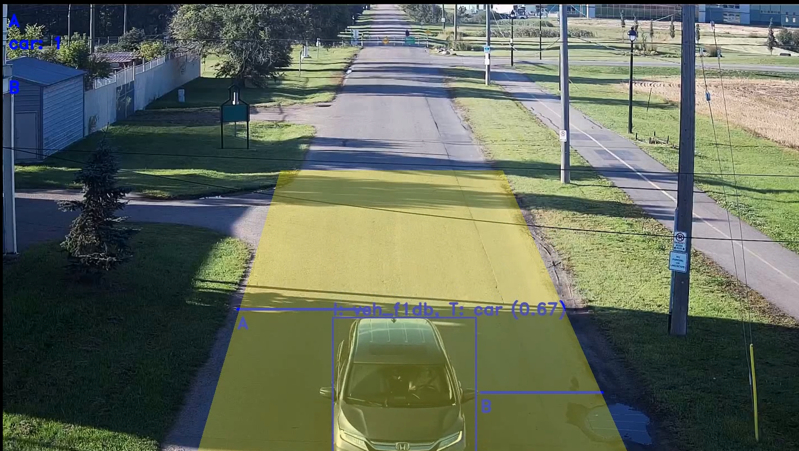

# Real-time Road Traffic Surveillance using Cloud

 

## Ivy
Ivy is an open source video-based vehicle counting system which employs several computer vision techniques to detect, track and count vehicles in a traffic scene.

 

## Requirements
- Python 3

## Setup
- Clone this repo `git@github.com:nicholaskajoh/ivy.git`.
- Create and/or use a virtual environment (optional but recommended).
- Install the dependencies in _requirements.txt_ `pip install -r requirements.txt`.
- Install detector YOLO's dependencies where necessary 

| Detector | Description | Dependencies |
|---|---|---|
| `yolo` | Perform detection using models created with the YOLO (You Only Look Once) neural net. https://pjreddie.com/darknet/yolo/ | |

## Run
- Create a _.env_ file (based on _.env.example_) in the project's root directory and edit as appropriate.
- Run `python -m  main`.

## Demo
Download [ivy_demo_data.zip](https://drive.google.com/open?id=1JtEhWlfk1CiUEFsrTQHQa0VkTi3IKbze) and unzip its contents in the [data directory](/data). It contains detection models and a sample video of a traffic scene.

